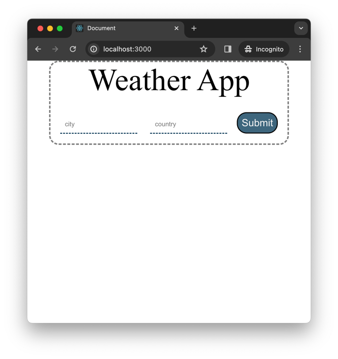

The app is still in progress. 

This app is my attempt to learn React.js and practice using the openWeather API. 

To run the app, navigate to the folder from the terminal and run the command, "npm start"


# React Project Readme

Welcome to weather-app! Simple weather app to show the weather based on geographical location built using React and OpenWeather API. Follow the instructions below to get started.

## Prerequisites

Make sure you have the following installed on your machine:

- [Node.js](https://nodejs.org/)
- [npm](https://www.npmjs.com/) or [yarn](https://yarnpkg.com/)


## Clone the repository:
   ```bash
   git clone https://github.com/your-username/your-project.git
   ```

## Navigate to repository

   ```bash
   cd weather_app
   ```

## Run the App

   ```bash
   npm start
   ```
## Some Screenshots


